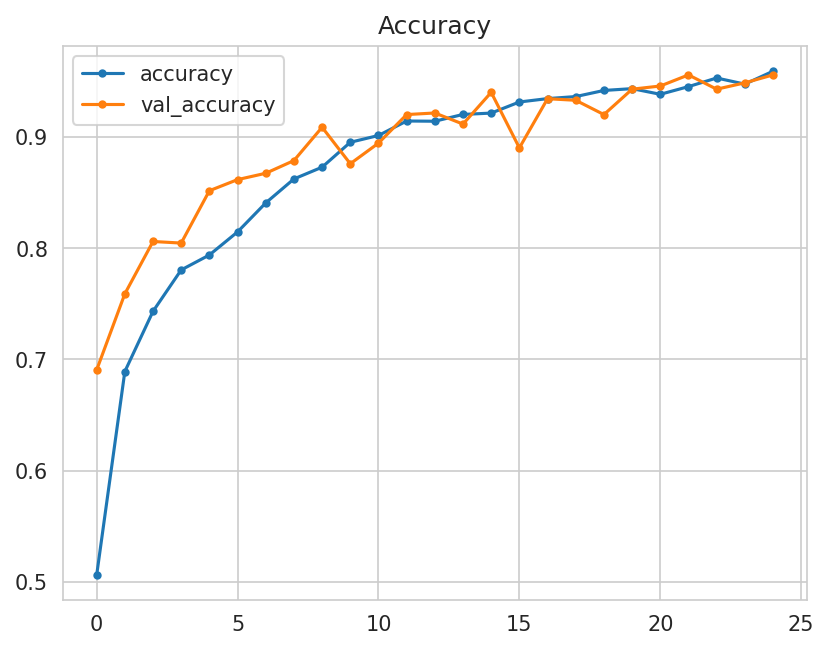
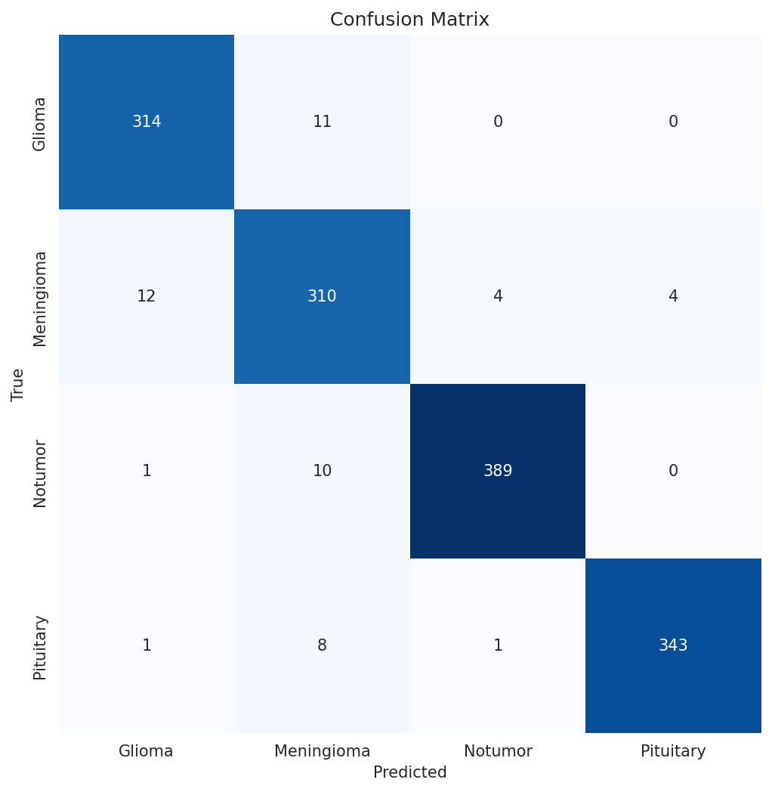
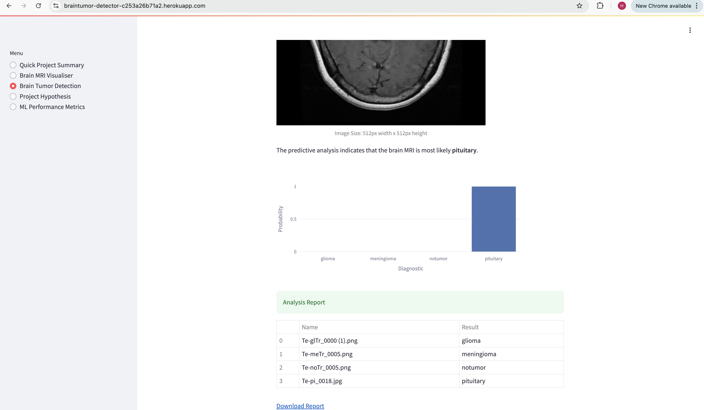

# **Brain Tumor Detector**

* [Live website](https://braintumor-detector-c253a26b71a2.herokuapp.com/)
* [Project User Stories](https://github.com/users/HasibullahFathi/projects/7)

## Summary
The Brain Tumor Detector is a predictive analytics tool designed to help healthcare professionals differentiate between healthy brains and those with Glioma, Meningioma, or Pituitary tumors based on MRI images. Created as a business-oriented solution, this Streamlit-powered app allows users to upload MRI scans, which the model then analyzes to provide an immediate diagnostic prediction. The dashboard includes data insights, project descriptions, and model performance metrics, offering clients a comprehensive understanding of the classifier's accuracy and effectiveness.

---

## Table of Contents

Here's a table of contents for your project documentation:

---

# Table of Contents

2. [Dataset Information](#dataset-information)
   - [About the Dataset](#about-the-dataset)
   - [Dataset Description](#dataset-description)

3. [Business Requirements](#business-requirements)
   - [Key Stakeholders](#key-stakeholders)
   - [Business Objectives Summary](#business-objectives-summary)
   - [Hypotheses and Validation](#hypotheses-and-validation)

4. [Mapping Business Requirements to Data Visualizations and Machine Learning Tasks](#mapping-business-requirements-to-data-visualizations-and-machine-learning-tasks)
   - [Data Visualization](#business-requirement-1-data-visualization)
   - [Classification](#business-requirement-2-classification)
   - [ML Business Case](#ml-business-case)

5. [Model Development](#model-development)
   - [Model Overview - Version 1](#model-development-overview-version-1)
   - [Model Architecture](#model-architecture)
   - [Compilation](#compilation)
   - [Model Overview - Version 2 (VGG16 Transfer Learning)](#model-development-overview-version-2-transfer-learning-with-vgg16)
   - [Model Overview - Version 3 (Fine-Tuned VGG16)](#model-development-overview-version-3-fine-tuned-transfer-learning-with-vgg16)
   - [Summary of Model Development](#summary-of-model-development-journey)

6. [Dashboard Design Overview](#dashboard-design-overview)
   - [Quick Project Summary](#quick-project-summary)
   - [MRI Visualizer](#mri-visualizer)
   - [Brain Tumor Detection](#brain-tumor-detection)
   - [Project Hypothesis](#project-hypothesis)
   - [ML Performance Metrics](#ml-performance-metrics)

7. [Bugs and Issues](#bugs-and-issues)
   - [Unfixed Bugs](#unfixed-bugs)
   - [Known Issues and Solutions](#issues)
   - [Testing](#testing)

8. [Deployment Instructions](#deployment-to-heroku)
   - [Heroku Deployment](#deployment-to-heroku)
   - [Forking the Repository](#forking-the-repository)
   - [Cloning the Repository](#cloning-the-repository)

9. [Environment and Libraries](#data-analysis-and-machine-learning-libraries)
   - [Machine Learning and Data Analysis Libraries](#data-analysis-and-machine-learning-libraries)
   - [Additional Libraries](#additional-libraries)
   - [Environment Management](#environment-management)

10. [Credits](#credits)
    - [Content Sources](#content)
    - [Acknowledgements](#acknowledgements)

---

# Dataset Information

### About the Dataset

This dataset is a compilation derived from three key sources: Figshare, Br35H, and a third source, which was later excluded due to data quality concerns.

### Dataset Description
The dataset comprises 7,023 MRI images of human brains, organized into four distinct classes, with a focus on brain tumors and their classification. These classes are:

**Glioma**: Cancerous tumors originating in glial cells, potentially aggressive and difficult to treat.

**Meningioma**: Typically benign tumors that develop in the meninges, the protective layers surrounding the brain and spinal cord.

**No Tumor**: Normal brain scans without detectable tumors, serving as a control group in classification tasks.

**Pituitary**: Tumors that affect the pituitary gland, which may be either benign or malignant and impact hormone regulation.

This dataset is instrumental in advancing machine learning models aimed at the early and accurate detection of brain tumors. Such models are invaluable for the medical field, as they enhance diagnostic precision, contribute to improved treatment plans, and support critical advancements in neurology. By enabling automated classification, machine learning models developed with this dataset can drive meaningful progress in tumor diagnosis, ultimately improving healthcare outcomes for those affected.

The "No Tumor" class images were specifically sourced from the Br35H dataset.

**Note**: The images in this dataset vary in size. After pre-processing, such as removing excess margins, resizing to consistent dimensions is recommended for optimal model training.

For access to the dataset and further information, [visit the Brain Tumor Dataset on Kaggle.](https://www.kaggle.com/datasets/masoudnickparvar/brain-tumor-mri-dataset)

[Back to top ⇧](#table-of-contents)

---

# Business Requirements

The main goal of this project is to develop a machine learning model that accurately detects and classifies brain tumors from MRI images, specifically distinguishing between Glioma, Meningioma, Pituitary tumors, and normal (tumor-free) brain scans. This model aims to support medical professionals in making timely and accurate diagnoses, offering patients the benefit of early detection and improved treatment planning.

**Key stakeholders for this project include:**

### Key Stakeholders:
- **Medical Professionals**: For improved diagnostic support
- **Patients**: Beneficiaries of early detection and effective treatment strategies
- **Healthcare Providers**: Hospitals and clinics invested in innovative diagnostic tools

### Business Objectives Summary

1. **Visual Analysis**: The client is interested in a visual comparison of MRI scans of healthy brains versus those with tumors. This analysis should include average image characteristics and variability within each of the four tumor classes in the dataset.

2. **Functional Model Development**: The client requires a robust ML model capable of predicting the presence of specific types of tumors (or their absence) from MRI images. A deep learning pipeline will be developed to handle the four-way classification task and support deployment for clinical use.

3. **Interactive Dashboard**: A Streamlit dashboard will be developed as a platform to present the analysis results and predictions. The dashboard will also provide an interface for users to upload new MRI scans for real-time tumor classification.

### Hypotheses and Validation

The initial hypotheses for each business objective are outlined as follows:

#### Hypothesis 1: **Visual Differentiation Hypothesis**
> **Hypothesis:** MRI scans of healthy brains and those affected by different tumor types (Glioma, Meningioma, Pituitary) exhibit unique visual patterns distinguishable by machine learning models.
> 
> **Validation:** Successfully validated through the model’s performance in test accuracy (96.31%) and low test loss (0.11078). Additionally, confusion matrix analysis confirmed that each class demonstrated distinct, recognizable visual features, leading to high classification accuracy across the four categories.

---

#### Hypothesis 2: **Data Augmentation Hypothesis**
> **Hypothesis:** Data augmentation techniques, such as rotation, flipping, and brightness adjustment, would improve the model's generalization and help mitigate overfitting by providing diverse examples of MRI images.
>
> **Validation:** This hypothesis was validated as the data augmentation contributed significantly to the model's stable and high performance. The test accuracy of 96.31% without signs of overfitting in the accuracy and loss curves indicates effective generalization, supporting the utility of augmentation in enhancing model robustness.

---

#### Hypothesis 3: **Multi-class Classification Hypothesis**
> **Hypothesis:** A deep learning model, specifically one using a Convolutional Neural Network (CNN) architecture, can accurately classify MRI brain scans into four categories (Glioma, Meningioma, Pituitary tumor, and No Tumor) based on distinctive features of each type.
>
> **Validation:** Fully validated by the model’s high test accuracy (96.31%), indicating strong classification capabilities. Performance metrics like precision, recall, and F1-score for each class were within acceptable ranges, confirming the model's ability to reliably differentiate among the four categories in real-world MRI scan analyses.

**Model performance and potential improvements:**

The brain tumor classification model achieved strong results with a test accuracy of 96.31% and a test loss of 0.11078, but it did not reach 100% accuracy. The model's performance was limited by the diversity and quantity of the dataset, as well as variations in real-world MRI scans that differ from the dataset's structure. Improvements could come from increasing the dataset size to capture more variability, adding MRI images from different views (such as sagittal and coronal views), and further tuning hyperparameters. Training for additional epochs with robust data augmentation may also enhance generalization to new, unseen MRI scans.


[Back to top ⇧](#table-of-contents)

---

# Mapping Business Requirements to Data Visualizations and Machine Learning Tasks

**Accuracy**: 
To ensure model accuracy, visualizations will display performance metrics in a way that makes them accessible to all users. By plotting training and validation learning curves, we can monitor progress across epochs, and a confusion matrix will provide a detailed view of how well the model differentiates between the four classes: Glioma, Meningioma, Pituitary tumor, and healthy brain.

**Interpretability**: 
Interpretability is central to the project, and visualizations will support this requirement by revealing insights into the model's prediction process. For instance, feature importance or activation maps could offer glimpses into which image regions influence model decisions, aligning well with interpretability goals.

**Scalability**: 
By visualizing the model’s performance across different data sizes, we ensure scalability. These analyses will confirm that the model maintains accuracy and reliability, even with large datasets, aligning with the project's need for a scalable solution.

**Speed**: 
Monitoring model inference time, displayed in visualizations, will help us confirm that the model can provide quick predictions. This metric is vital for meeting the requirement of providing real-time results, supporting fast diagnosis.

**Privacy**: 
Ensuring patient privacy is a priority, handled through data anonymization practices during data handling and deployment. These practices are integrated into the data pipeline to meet compliance standards, securing sensitive data from end to end.

### Business Requirement 1: Data Visualization

Project [User Stories](https://github.com/users/HasibullahFathi/projects/7/views/1)

- **Navigation and Dashboard**: 
    - *User Story*: As a client, I can easily navigate an interactive dashboard to view and understand the data.
    - *Solution*: A user-friendly Streamlit dashboard that intuitively presents the key visualizations and insights, providing a straightforward experience for data exploration.

- **Graphical Analysis of Brain MRI Images**:
    - *User Story*: As a client, I can view visual graphs showing average images, differences, and variabilities between MRI scans of healthy and tumor-affected brains to better identify each category.
    - *Solution*: Visualization of averaged MRI images per category will highlight the differences, while variability plots will show the degree of deviation within each class.

- **Image Montage**:
    - *User Story*: As a client, I can view an image montage of MRI scans from healthy brains and those with tumors, helping me to differentiate them visually.
    - *Solution*: An interactive image montage feature on the dashboard that allows comparison across classes, showcasing diverse examples for visual reference.

### Business Requirement 2: Classification

- **Image Upload and Prediction**:
    - *User Story*: As a client, I can upload brain MRI images to the dashboard for immediate and accurate predictions on potential brain tumors.
    - *Solution*: The dashboard will include an upload feature where users can submit MRI images. The model will then run inference to classify the image as one of the four categories, providing results in real-time.

- **Prediction Logging**:
    - *User Story*: As a client, I can save model predictions in a timestamped CSV file, creating a documented history of predictions.
    - *Solution*: Each prediction, including the timestamp, image name, and prediction results, will be saved to a CSV file for record-keeping, providing a reliable history of past analyses and predictions.

## ML Business Case

The client aims to develop a machine learning solution capable of accurately identifying brain tumors from MRI images. This objective will be achieved by building a robust TensorFlow deep learning pipeline trained on a dataset that categorizes brain images into four classes: Glioma, Meningioma, Pituitary tumors, and normal brain (no tumor). Leveraging convolutional neural networks (CNNs), known for their effectiveness in image recognition, the model will identify unique patterns associated with each class.

The core deliverable is a multi-class classification model that outputs a label indicating the tumor type (or absence thereof) based on the calculated probabilities. Brain images flagged as having a tumor will be directed toward further medical review for possible intervention, while normal scans will proceed to routine checks as per medical guidelines.

The success of this model will hinge on high accuracy and recall rates, measured by an F1 score and recall specifically for tumor detection. High recall is essential to minimize the chance of missing actual tumor cases (false negatives), as the consequences of undiagnosed tumors are far more critical than false positives. The client targets an F1 score of 0.95 or above, with a recall rate of 0.98 or higher for tumor detection. However, the provided dataset could pose limitations in achieving these high thresholds.

Ultimately, this model aims to support accurate and early tumor diagnoses, improving patient outcomes and optimizing healthcare resource allocation.

[Back to top ⇧](#table-of-contents)

---

# Model Development

### Model Development Overview version 1

This brain tumor classification model is a Convolutional Neural Network (CNN) built using Keras, optimized for multi-class classification. It has been designed to identify four classes of brain MRI images: *Glioma*, *Meningioma*, *Pituitary tumors*, and *No Tumor*. Here is a breakdown of its architecture and features:

### Model Architecture

The CNN model consists of the following main components:

- **Input Layer:** The model accepts input images with the defined `image_shape`, which was determined through preprocessing and resizing.

- **Convolutional Layers and Pooling Layers:** 
    - *Layer 1:* The first convolutional layer applies 32 filters of size 4x4 with ReLU activation, followed by a max-pooling layer with a pool size of 3x3.
    - *Layer 2:* The second convolutional layer uses 64 filters of 4x4 with ReLU activation, followed by max-pooling.
    - *Layer 3 and 4:* These layers use 128 filters each, with 4x4 kernels and ReLU activation. After the fourth layer, a flattening layer converts the multidimensional output into a one-dimensional array for processing by the dense layers.

- **Dense Layers:**
    - The first dense layer contains 512 neurons, activated by ReLU. This layer processes features extracted by the convolutional layers.
    - A dropout layer with a rate of 0.5 follows, ensuring regularization to prevent overfitting.
    - The final dense layer has `N_TYPES` neurons with a softmax activation function, providing probability-based outputs for each of the four classes (Glioma, Meningioma, Pituitary, and No Tumor).

### Compilation

- **Optimizer:** The Adam optimizer is used with a learning rate of 0.001. This choice balances convergence speed with stability, which is essential in training deeper networks.
- **Loss Function:** Categorical cross-entropy is used as the loss function since it is suitable for multi-class classification tasks.
- **Metrics:** Accuracy is chosen as the primary metric to monitor model performance during training.

### Callbacks and Training Process

To enhance training effectiveness and prevent overfitting:
- **Early Stopping:** This callback monitors validation loss and stops training if it doesn't improve for a specified patience period, thus saving the best weights.
- **Learning Rate Reduction:** If validation loss plateaus, this callback reduces the learning rate to allow finer adjustments in model weights, helping to improve convergence.

Training is conducted with an increased `steps_per_epoch`, repeating the dataset multiple times per epoch to ensure adequate learning from each batch.

<details>
<summary>See Images</summary>




</details>

---

### Model Development Overview: Version 2 Transfer Learning with VGG16

For the second iteration of the brain tumor classification model, transfer learning is employed with the VGG16 architecture as a base. This approach leverages pre-trained weights on ImageNet, enabling the model to benefit from feature extraction on a large, diverse dataset, which aids in handling smaller, domain-specific datasets like MRI brain scans. The model is designed for multi-class classification across four classes: *Glioma*, *Meningioma*, *Pituitary tumors*, and *No Tumor*.

#### Model Architecture

The model incorporates the following components:

- **Convolutional Base (VGG16):** 
  - The pre-trained VGG16 model is used as a feature extractor, loaded with ImageNet weights. The `include_top=False` parameter removes the fully connected (Dense) layers, keeping only the convolutional layers for feature extraction.
  - The VGG16 base layers are set to non-trainable (`conv_base.trainable = False`), which preserves the learned features while reducing the computational cost.

- **Dense Layers:**
  - A `Flatten` layer follows the VGG16 base, converting the output from the convolutional feature map into a one-dimensional array for further processing.
  - A dense layer with 256 neurons and ReLU activation is added, enabling the model to learn complex patterns specific to the brain tumor classes.
  - The final dense layer has `N_TYPES` neurons with a softmax activation function, generating probabilities for each of the four classes.

#### Compilation

- **Optimizer:** Adam optimizer with a learning rate of 0.001, balancing efficient convergence and stability.
- **Loss Function:** Categorical cross-entropy, suitable for multi-class classification.
- **Metrics:** Accuracy is chosen to track model performance during training and evaluation.

#### Callbacks and Training Process

To optimize model training and prevent overfitting:
- **Early Stopping:** Monitors validation loss, stopping training if it doesn't improve within a set patience period, ensuring the best weights are retained.
- **Learning Rate Reduction:** Reduces the learning rate when validation loss stagnates, improving convergence in later epochs.

The model is trained over 20 epochs with the training and validation datasets, supported by early stopping and learning rate reduction.

<details>
<summary>See Images</summary>


</details>

---

### Model Development Overview: Version 3 Fine-Tuned Transfer Learning with VGG16

In this third version, transfer learning is extended with fine-tuning, building upon the initial VGG16 model while retraining the later layers for enhanced specialization on MRI brain scans. This approach aims to improve classification by focusing the model’s attention on domain-specific features within the brain tumor dataset.

### Model Architecture

The model architecture includes:

- **VGG16 Convolutional Base:**
  - As with the previous version, the VGG16 model pre-trained on ImageNet is used as a feature extractor, with the `include_top=False` parameter to remove its Dense layers.
  - Fine-tuning is enabled in the final convolutional block (`block5`) by unfreezing layers from `block5_conv1` onward, allowing the model to adjust high-level features specific to MRI images while retaining the general features learned in earlier blocks.

- **Dense and Dropout Layers:**
  - A `Flatten` layer transforms the VGG16 output into a 1D array.
  - A dense layer with 128 neurons and ReLU activation is added to capture complex patterns. A dropout layer with a 0.5 dropout rate follows, improving generalization by randomly setting half of the neurons to zero during training.
  - The final dense layer contains `N_TYPES` neurons with a softmax activation function, providing a probability distribution across the four classes.

### Compilation

- **Optimizer:** The RMSprop optimizer with a learning rate of \(1 \times 10^{-5}\), chosen to fine-tune parameters slowly and avoid disruptive weight updates.
- **Loss Function:** Categorical cross-entropy, appropriate for multi-class classification tasks.
- **Metrics:** Accuracy is used to monitor performance.

### Callbacks and Training Process

To avoid overfitting and improve model stability:
- **Early Stopping:** Terminates training if the validation loss doesn’t improve within five epochs, retaining the best-performing weights.
- **Learning Rate Reduction:** Reduces the learning rate by a factor of 0.3 if the validation loss stagnates, helping the model fine-tune its parameters effectively.

Training runs for up to 15 epochs, with early stopping and learning rate reduction enabled to ensure optimal convergence.

<details>
<summary>See Images</summary>


</details>

---

### Summary of Model Development Journey

After initial tests with a custom CNN model (Version 1), the accuracy and loss results didn’t meet expectations, prompting a shift to transfer learning in Version 2. Using a pre-trained VGG16 model with frozen layers, additional custom layers were added on top. While this approach yielded high accuracy and low loss, the confusion matrix revealed poor brain tumor classification, indicating a need for more refinement.

In Version 3, further hyperparameter tuning and selective fine-tuning were applied by unfreezing VGG16’s last convolutional block. However, despite these adjustments, the confusion matrix still indicated suboptimal classification performance.

Ultimately, the first model (Version 1) proved to be the most effective. After slight hyperparameter tuning and model optimization, it achieved a balanced performance with the best confusion matrix results and the following metrics:
- **Test Loss:** 0.11078
- **Test Accuracy:** 96.31%

**This approach confirmed that, despite lower initial accuracy, the simpler custom CNN with focused adjustments provided the best performance for reliable brain tumor classification.**

[Back to top ⇧](#table-of-contents)

---

## Dashboard Design Overview

The project is delivered through a user-friendly Streamlit dashboard, comprising five interactive pages that guide the client through the main features and insights generated by the model. The pages are accessible through a sidebar menu for easy navigation.

1. ### Quick Project Summary
   - The homepage provides a concise overview of the project, outlining the business context, objectives, and motivations for building the brain tumor classification tool. This page also includes links to supplementary documentation for clients seeking in-depth information.
   <details>
   <summary>See Image</summary>
   
   </details>

2. ### MRI Visualizer
   - This page addresses the **first business objective**—Data Analysis—by enabling visual exploration of MRI data. It includes interactive plots that can be toggled via a built-in toolbar, allowing users to examine data distributions and patterns in MRI scans.  
   - Additionally, the **image montage tool** lets users select specific labels (Glioma, Meningioma, Pituitary, and No Tumor) and view a montage of random MRI images from the validation set, making it easier to visualize and compare various brain conditions.
   <details>
   <summary>See Image</summary>
   
   </details>

3. ### Brain Tumor Detection
   - Fulfilling the **second business objective**, this page offers a tool for detecting brain tumors in MRI images. Users can download MRI scans from the dataset, upload them to the dashboard, and receive class predictions (Glioma, Meningioma, Pituitary or No Tumor) generated by the model.
   - Outputs include a **categorical class prediction** with a percentage-based graphical representation, as well as the option to **download predictions** as a CSV file.
   <details>
   <summary>See Images</summary>
   
   
   </details>

4. ### Project Hypothesis
   - This page provides documentation of the project’s hypotheses, followed by an analysis of findings in relation to those hypotheses. It aligns with the data presented in the documentation and serves to explain the theoretical basis for the model's development and its potential use cases in medical imaging.
   <details>
   <summary>See Image</summary>
   
   </details>

5. ### ML Performance Metrics
   - This final page documents dataset characteristics, including size and label distributions, highlighting any target imbalances. 
   - The model’s **training history** is displayed through epoch-wise graphs of validation loss and accuracy, illustrating model progress over time. A **confusion matrix** further visualizes classification accuracy, showing how well the model performs on each class.
   - The model structure.
   <details>
   <summary>See Image</summary>
   
   </details>

This structured and intuitive dashboard ensures that clients can easily explore data, interact with model predictions, and access all relevant insights related to the project’s goals.

[Back to top ⇧](#table-of-contents)

---

## Bugs and Issues

### Unfixed Bugs
There is no known unfixed bugs in the project.


### Issues
To optimize deployment on Heroku and have an app with updated version all packages and dependencies, I created a custom template to the project's requirements. During development, I had installed several packages, but when deploying, I faced an issue with Heroku’s 500 MB slug size limit.

To address this:

1. I used a `Pipfile` to list only the essential packages, removing any unnecessary dependencies that were added during development.
2. I locked these required dependencies to specific versions suitable for production.
3. To further reduce the slug size, I added any large, non-essential files to a `.slugignore` file to exclude them from deployment.

This approach minimized the app's size, enabling a successful Heroku deployment.

[Back to top ⇧](#table-of-contents)

---

### Testing

| Test Case                         | Expected Result                                                                                | Test Result |
|-----------------------------------|-----------------------------------------------------------------------------------------------|-------------|
| **Homepage (Summary page)**       |                                                                                               |             |
| Open the Homepage                 | Homepage loads with the correct template and data                                              | ✅ PASS      |
| Navigation bar                    | By selecting menu option from side bar it opens the correct page                               | ✅ PASS      |
| Open the Homepage                           | Homepage loads with the correct template, displaying an overview of the project                           | ✅ PASS      |
| Links to supplementary documents (dataset)           | Links to the Kaggle dataset is clickable and redirect to the correct resources                                | ✅ PASS      |
| **MRI Visualizer Page**          |                                                                                               |             |
| Open MRI Visualizer page                                | Page loads with the correct template and data for plots                        | ✅ PASS      |
| Select "Difference between Average and Variability"     | Checkbox selection the visualization to show differences between average and variability images for each tumor type | ✅ PASS      |
| Select "Difference between No Tumor and Each Tumor Type" | Checkbox selection visualization to display differences between No Tumor and each tumor type | ✅ PASS      |
| Select "Image Montage"                                  | Checkbox selection displays image montage options                                                   | ✅ PASS      |
| Select specific label from dropdown menu for Image Montage                 | Image montage displays a grid of MRI images for the chosen label (Glioma, Meningioma, Pituitary, No Tumor) | ✅ PASS      |
| View differences between tumor types                    | Users can visually observe intensity or texture variations between each tumor type and No Tumor class | ✅ PASS      |
| **Brain Tumor Detection Page**          |                                                                                               |             |
| Open Brain Tumor Detection page                      | Page loads with correct template, including options to upload MRI scans and view predictions                       | ✅ PASS      |
| Upload single MRI scan (jpg, jpeg, png) images       | MRI scan uploads successfully, and class prediction (Glioma, Meningioma, Pituitary, or No Tumor) is displayed      | ✅ PASS      |
| Upload multiple MRI scans (jpg, jpeg, png) images    | Multiple MRI scans upload successfully, and class predictions are generated for each scan                          | ✅ PASS      |
| View prediction output                               | Class prediction is displayed with a graphical representation showing prediction percentages for each category     | ✅ PASS      |
| Download predictions as CSV                          | Predictions for all uploaded scans are saved in a downloadable CSV file, with timestamp and class labels           | ✅ PASS      |
| **Hypotheses and Analysis Page**          |                                                                                               |             |
| Open the Hypotheses and Analysis Page       | Page loads with correct template, displaying project hypotheses and analysis of findings                  | ✅ PASS      |
| Display of Hypotheses                       | Hypotheses are clearly presented, providing context for the model's development                           | ✅ PASS      |
| **ML Performance Metrics Page**          |                                                                                               |             |
| Open the ML Performance Metrics Page            | Page loads with correct template, displaying dataset characteristics, training history, confusion matrix, and model structure | ✅ PASS      |
| Responsive design                                       | Layout adjusts properly without overlap or misalignment across different screen sizes                | ✅ PASS      |
| Links                                       | All the links are working properly and redirect to the correct source.                | ✅ PASS      |

[Back to top ⇧](#table-of-contents)

---

## Deployment to Heroku

The brain tumor detector app was deployed on Heroku from GitHub, following these organized steps:

1. **Account Setup**
   - With an existing Heroku account, no new account creation was necessary.

2. **App Creation**
   - Created a new app in Heroku, named **"braintumor-detector"**.

3. **Procfile**
   - Ensured a `Procfile` was in the root directory, containing:
     ```plaintext
     web: sh setup.sh && streamlit run app.py
     ```
   - This line initiates `setup.sh` and runs the Streamlit app, making sure the server starts correctly.

4. **Dependency Management**
   - Added a `requirements.txt` file for all necessary dependencies.
   - For this deployment, `Pipfile` and `Pipfile.lock` were used to lock down only essential packages, reducing app size and excluding unnecessary libraries. This optimization helped prevent issues with Heroku's size constraints.

5. **Connecting GitHub**
   - In the **Deploy** tab of the Heroku app dashboard, under **Deployment method**, selected **GitHub**.
   - Authorized Heroku to access GitHub and linked it to the repository by searching for **"brain-tumor-detector"** and connecting it.

6. **Python Runtime Specification**
   - Created a `runtime.txt` file in the root directory and added the line:
     ```plaintext
     python-3.12
     ```
   - This specifies the Python version for Heroku to use.

7. **File Optimization with .slugignore**
   - To manage app size effectively, added a `.slugignore` file, excluding any large files that are not necessary for app functionality. This is crucial for adhering to Heroku’s slug size limitations.

8. **Deploying the App**
   - Back in the **Deploy** section of the Heroku dashboard, selected **main** as the deployment branch under **Manual deploy** and clicked **Deploy Branch**.

9. **Launching the Application**
   - After deployment completed successfully, clicked **Open App** to access the live application.

The app is now accessible at: [https://braintumor-detector-c253a26b71a2.herokuapp.com/](https://braintumor-detector-c253a26b71a2.herokuapp.com/)

[Back to top ⇧](#table-of-contents)

---

## Forking the Repository

1. Go to the GitHub repository: [https://github.com/HasibullahFathi/brain-tumor-detector](https://github.com/HasibullahFathi/brain-tumor-detector).
2. Click the **Fork** button in the upper right-hand corner of the page to create your own copy of the repository.

## Cloning the Repository

1. Go to the GitHub repository: [https://github.com/HasibullahFathi/brain-tumor-detector](https://github.com/HasibullahFathi/brain-tumor-detector).
2. Locate the **Code** button near the top right of the page.
3. Choose your preferred method for cloning:
   - **HTTPS**: Select the HTTPS tab, then click the copy button to copy the URL.
   - **SSH**: Select the SSH tab, then click the copy button to copy the SSH URL.
   - **GitHub CLI**: Select the GitHub CLI tab and copy the URL.

4. Open **Git Bash** or your terminal of choice.
5. Change the working directory to where you want the cloned repository to be saved:
   ```bash
   cd /path/to/your/directory
   ```

6. Type the following command, replacing `<URL>` with the URL you copied:
   ```bash
   git clone <URL>
   ```

7. Press **Enter** to run the command and clone the repository to your local machine. 

You now have a local copy of the repository!

[Back to top ⇧](#table-of-contents)

---

## Data Analysis and Machine Learning Libraries
**List of the main libraries and packages used in this project.**

Here’s a refined version with a bit more clarity and consistency in style:

1. **shutil**: Provides high-level file operations such as deleting, copying, and moving files; used here to split the dataset into training, validation, and test sets.
2. **TensorFlow**: A machine learning library used to build models and perform image reshaping and resizing.
3. **Matplotlib**: Used for plotting data to help visualize insights.
4. **NumPy**: Supports array-based data structures, enabling efficient numerical operations.
5. **Pandas**: Converts numerical data into DataFrames, making it easier to perform functional operations on the data.
6. **Seaborn**: A data visualization library used for presenting insights, like confusion matrix heatmaps and scatter plots for image dimensions.
7. **Plotly**: Provides interactive graphical visualizations, especially useful for interactive dashboard charts.
8. **VisualKeras**: Enables visualization of model layers and structure, helping to better understand model architecture.
9. **Streamlit**: A framework for building and deploying web-based data science and machine learning applications, allowing users to interact with the dashboard.
10. **Scikit-learn**: Used in model creation, training, evaluation, and preprocessing models.

### Additional Libraries

- **Joblib**: A library for saving the models.
- **Pillow**: Used for image manipulation tasks, such as resizing and editing images.

### Environment Management

The `[requires]` section specifies that the project requires **Python 3.12**, ensuring compatibility and consistency in the development environment. The `Pipfile.lock` file will further secure exact version specifications, helping avoid conflicts and maintaining a stable environment.

[Back to top ⇧](#table-of-contents)

---

## Credits

### Content

This project’s structure is largely influenced by the "Walkthrough Project 01 - Malaria Detector." Numerous functions for data manipulation, plotting, model cross-validation, and testing—as well as the Python scripts for the Streamlit dashboard and the organization of the Jupyter notebooks—are inspired by that project. However, I’ve customized the code as needed, removing any irrelevant sections and making substantial adjustments where applicable. I have also thoroughly documented the functions to demonstrate a clear understanding of their workings.

In addition, [Stack Overflow](https://stackoverflow.com/) the key resource for resolving various questions related to the usage of libraries and debugging issues encountered during development. [Youtube](https://youtube.com/) also proved helpful in gaining a better understanding of transfer learning.

### Acknowledgements

I extend my deepest gratitude to my mentor, Mo Shami, for his invaluable guidance and insightful suggestions throughout this project. His expertise and support have been instrumental in shaping its direction and achieving successful outcomes.

A special thanks to the Code Institute for providing the foundational resources, support, and inspiration that made this project possible. 

[Back to top ⇧](#table-of-contents)


